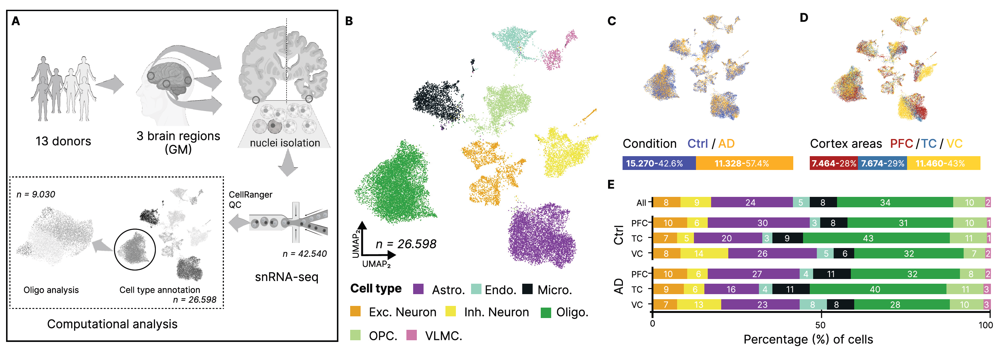

# Human AD and Ctrl snRNA-seq and visium data across cortical areas

This repo contains all analysis scripts of the manuscript "**Brain Region-Specific Oligodendrocyte States Highlight Mitochondrial Gene Upregulation and Loss of Canonical Identity Signatures in Alzheimer’s Disease**" by Drummer et al. 

## Datasest

The data will be made public upon publication.

## Citation

Please cite our preprint: TODO: INSERT BIOARVIX LINK

